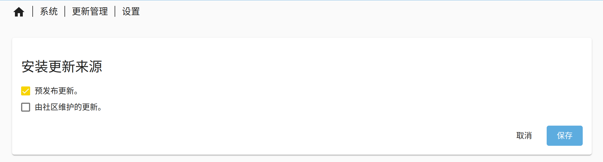
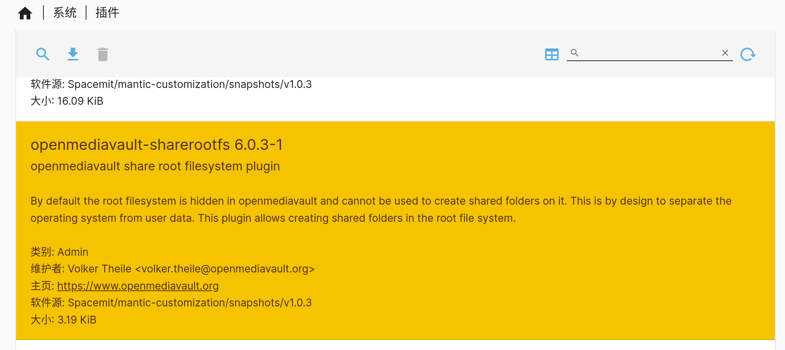
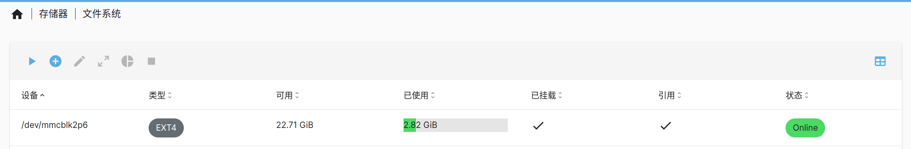

# 基础设置

## 软件源更新

为保证体验建议优先更新到最新软件系统，相当于执行 `apt update`。

- 点击“系统 -> 更新管理 -> 设置”， 勾选“预发布更新”，点击“保存”，等待更新。

## 根文件系统挂载

Bianbu NAS 通过 `sharerootfs` 插件管理根文件系统，要挂载根文件系统先下载 `sharerootfs` 插件。

- 点击“系统 -> 插件”，选中 `sharerootfs` 插件，点击下载按钮。

- 下载`sharerootfs` 插件之后，点击“存储器 -> 文件系统”，查看已挂载的根文件系统。

