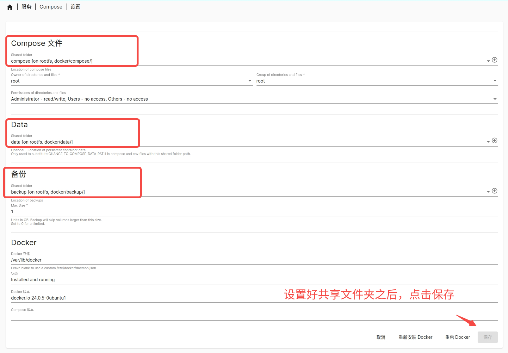
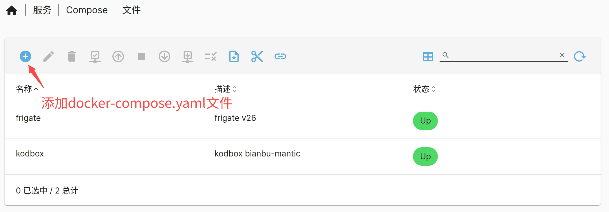
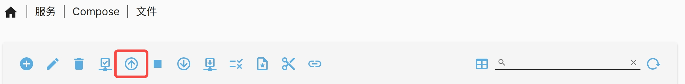
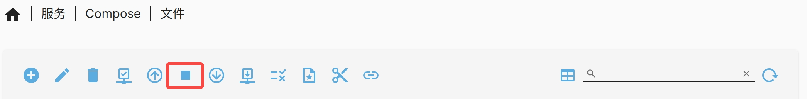
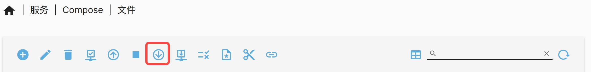
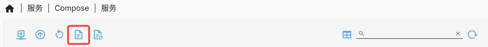

# Docker服务

本节列举已移植的 Docker 镜像和拉取地址、介绍如何创建和访问 Docker 服务实例。

## Docker镜像列表

当前已移植了一些典型的 Docker 应用，名称和地址为：

| Docker应用名称 | 镜像地址                                         |
| -------------- | ------------------------------------------------ |
| Nextcloud      | harbor.spacemit.com/application/nextcloud:28.0.3 |
| Kodbox         | harbor.spacemit.com/application/kodbox:1.50.02   |
| Frigate        | harbor.spacemit.com/application/frigate:v26      |

上述 Docker 镜像均可使用 `docker pull` 命令拉取。

## 启动Docker后台服务

在创建 Docker 服务实例之前，需先确保 Docker 后台服务已启动。执行下述操作开启 Docker 后台服务：

1. 挂载磁盘和创建共享文件夹，至少创建三个共享文件夹。
2. 下载 `compose` 插件，下载后在“服务”页查看 `compose` 插件。
3. 打开“服务 -> Compose -> 设置”，选择共享文件夹，启动 Docker 服务。



## 创建Docker服务实例

本节介绍如何创建和访问 Docker 服务实例。

### NextCloud

通过 `docker-compose` 可以方便地编排 Docker 服务，`docker-compose` 可以将多个容器的配置集中到一个文件中。

- 点击“服务 -> Compose -> 文件”，添加 docker-compose.yaml 文件：



对于 NextCloud 服务，docker-compose.yaml 内容如下：

```Bash
version: '3.2'

networks:
  default:
    name: nextcloud

services:
  app:
    image: harbor.spacemit.com/application/nextcloud:28.0.3   # 移植的NextCloud镜像
    restart: unless-stopped
    volumes:
      - ./Nextcloud_docker/app:/var/www/html
    environment:
      - MYSQL_PASSWORD=nextcloud_password # 按需修改
      - MYSQL_DATABASE=nextcloud
      - MYSQL_USER=nextcloud
      - MYSQL_HOST=db
      - TZ=Asia/Shanghai
    ports:
      - 8443:443  # 映射 HTTPS 端口
    networks:
      - default

  db:
    image: harbor.spacemit.com/application/mariadb:10.11.6   # 移植的MariaDB镜像
    restart: unless-stopped
    volumes:
      - ./Nextcloud_docker/db:/var/lib/mysql
    environment:
      - MYSQL_ROOT_PASSWORD=nextcloud_mysql_password # 按需修改
      - MYSQL_PASSWORD=nextcloud_password            # 按需修改
      - MYSQL_DATABASE=nextcloud
      - MYSQL_USER=nextcloud
      - TZ=Asia/Shanghai
    networks:
      - default
```

添加之后，点击“⬆️”按钮拉取服务。如果本地没有下载 Docker 镜像，第一次拉取会比较耗时，因为要下载镜像。拉取完成后，浏览器输入 `https://HOST_IP:8443` 访问 NextCloud，管理员账号和密码自行设置。

### Kodbox

Kodbox 的 docker-compose.yaml 内容如下：

```Bash
version: '3.5'

services:
  kodbox:
    image: harbor.spacemit.com/application/kodbox:1.50.02   # 移植的docker镜像
    restart: always
    ports:
      - 8080:80                       # 左边8080是使用端口，可以修改
    volumes:
      - "./site:/var/www/html"        #./site是站点目录位置，可以修改
```

拉取服务之后，浏览器输入 `http://HOST_IP:8080` 访问 Kodbox，管理员账号和密码自行设置。

### Frigate

Frigate 的 docker-compose.yaml 内容如下：

```JavaScript
version: '3'

services:
  frigatev26:
    image: harbor.spacemit.com/application/frigate:v26
    container_name: frigatev26
    restart: unless-stopped
    tmpfs:
      - /tmp/cache:rw,exec,size=1000000000
    devices:
      - /dev/dri/renderD128
      - /dev/tcm
      - /dev/udma
      - /dev/udmabuf
      - /dev/video0
      
    shm_size: 64m
    volumes:
      - /root/workspace/frigate/storage:/media/frigate
      - /root/workspace/frigate/config:/config
      - /etc/localtime:/etc/localtime:ro
    environment:
      - FRIGATE_RTSP_PASSWORD=password
    ports:
      - "5000:5000"
      - "8554:8554"
      - "8555:8555/udp"
```

Frigate 服务需要通过串口或者 SSH 登录系统，在 `/root/workspace/frigate/config/` 目录下添加配置文件。从 https://pan.baidu.com/s/1IG13J9suGVOdYk4XVQjD3A（提取码: cmwc）下载 `frigate-config.tar` 压缩包，解压到 config 目录，解压之后的文件如下：


配置好之后，重新拉取服务。拉取完成等待30秒左右，浏览器输入 `http://HOST_IP:5000` 访问 Frigate。

## docker-compose指令解释

- **docker-compose up**



解析 `docker-compose.yml` 文件，拉取镜像（如果本地没有镜像）、创建网络、容器和卷、启动服务。

- **docker-compose stop**



停止运行的容器，但保留容器的状态和数据，可通过 `docker-compose up` 指令恢复。

- **docker-compose down**



停止容器，并删除容器、网络、卷等相关数据和状态，不能通过 `docker-compose up` 恢复。

- **查看服务运行日志**

