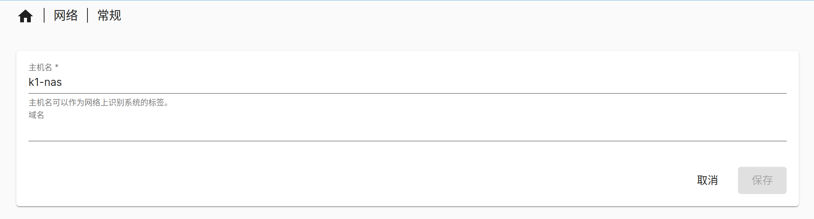
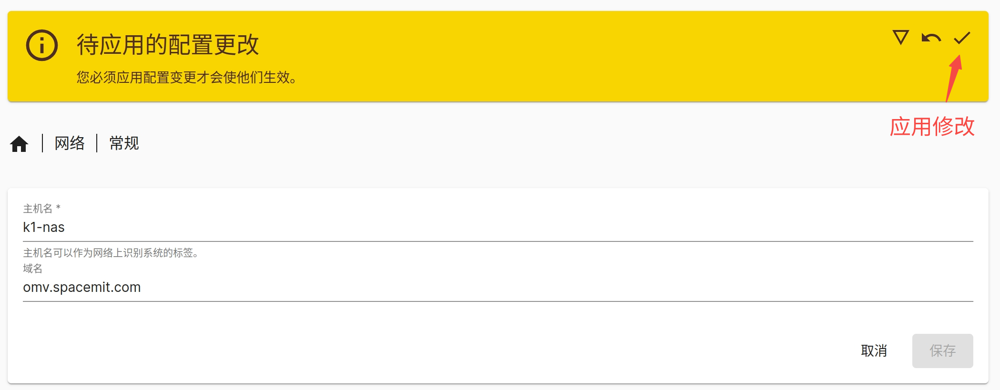
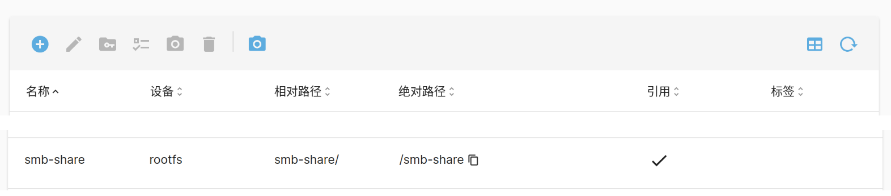
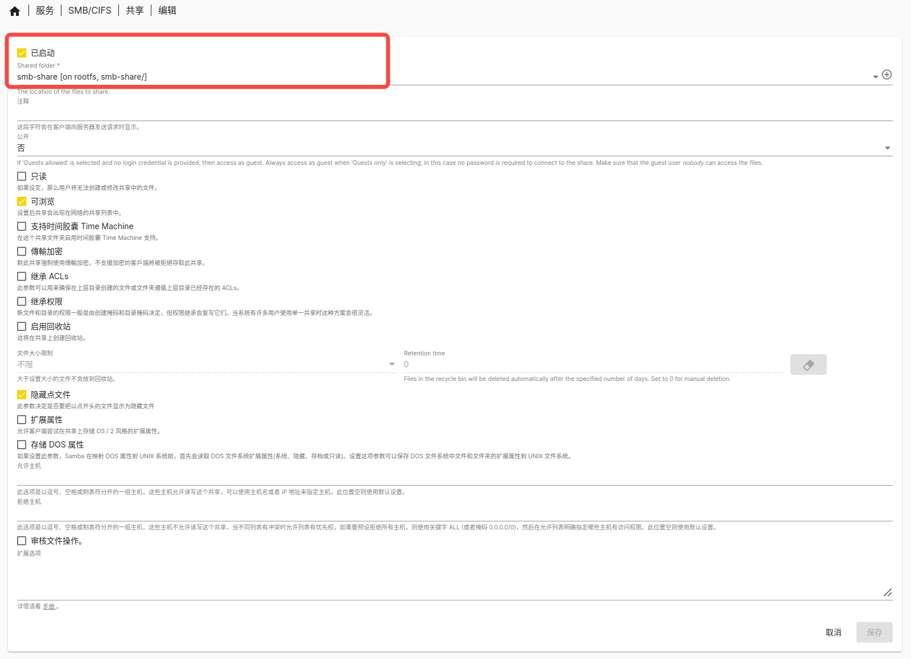
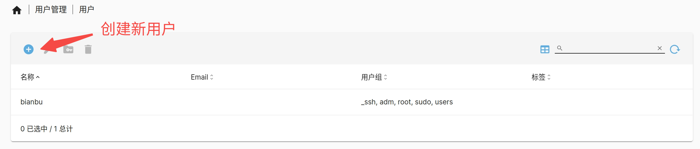
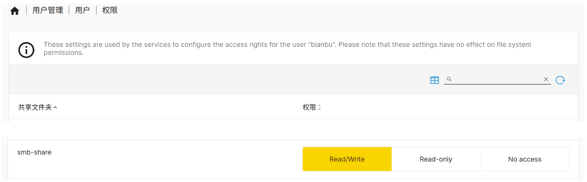

# 共享服务

本节以搭建 SMB 服务为例，介绍共享服务的搭建过程，其他服务可进行参考。

## 服务端设置

### 修改主机名

SMB 服务需确保主机名小于15个字符，所以需要先修改默认的主机名。其他服务没有这个要求，可跳过这一步。

- 点击“网络 -> 常规”，设置主机名。点击“保存”。



点击保存之后只是将更改保存到了数据库里，要将其应用到底层系统，需要进一步点击"应用更改"，此时系统会调用 `salt` 命令将数据库的记录写到系统配置，并重启系统服务。



### 挂载磁盘

共享的数据存储在磁盘上，故先挂载磁盘。如果该磁盘分区没有格式化，请先格式化（这一步要谨慎！！！）。

- 点击“存储器 -> 挂载”，选择要共享的磁盘并挂载。


### 创建共享文件夹

磁盘挂载之后不能直接使用，需要进一步创建共享文件夹，方便进行权限管理和数据隔离。

- 点击“存储器 -> 共享文件夹”，选择目标磁盘，在上面创建共享文件夹（以 `smb-share` 为例）。共享时将该文件夹通过网络服务共享出去。



### 创建SMB服务实例

- 点击“服务 -> SMB/CIFS -> 设置”，配置 SMB 服务，这里的设置是全局的，对所有 SMB 服务实例有效。


- 进一步，点击“服务- > SMB/CIFS -> 共享”，设置具体的 SMB 服务实例，这一步要选择共享文件夹（以 `smb-share` 为例）。



### 设置用户权限

共享服务的目的是在远端访问服务器资源，远端访问的时候需要权限，确保远端登录的用户对访问的共享文件夹具备相应权限。这里以创建一个用户并设置权限为例。

- 点击“用户管理 -> 用户”，创建用户（以 `bianbu` 用户为例，设置用户名和密码均为 `bianbu`）。



- 点击“用户管理 -> 用户 -> 权限 ”，设置用户对共享文件夹的权限。设置 `bianbu` 用户对 `smb-share` 共享文件夹的权限为可读可写。



在客户端连接 SMB 服务的时候，以该用户进行登录，即对共享的 SMB 服务具备预先设置的权限。

## 客户端连接

本节介绍不同客户端连接 SMB 服务的方法。假设：

- 服务端 IP 地址为 `HOST_IP`；
- 已搭建 SMB 服务实例，SMB 共享文件夹名为 `smb-share`；
- 已创建用户并设置对 `smb-share` 的权限为可读可写，用户名和密码均为 `bianbu`。

### Windows 文件管理器

打开“文件资源管理器”，选择“计算机 -> 映射网络驱动器”，输入共享文件夹地址：

```Bash
\\HOST_IP\smb-share
```

### Linux Nautilus 文件管理器

```Bash
smb://HOST_IP/smb-share
```

### Linux CLI

```Bash
mount.cifs //{HOST_IP}/smb-share /your_mount_path -o user=bianbu,password=bianbu
```