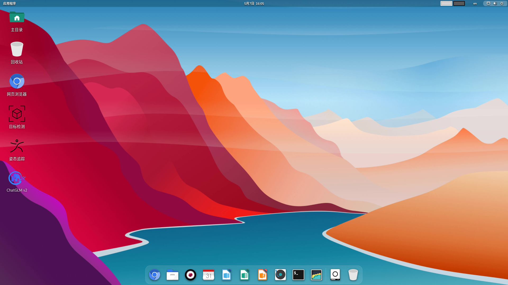

# Intro

Bianbu is an operating system deeply optimized for RISC-V architecture processors, built from Ubuntu community source code. It has versions like Bianbu Desktop and Bianbu NAS, suitable for different product fields.

## Why Bianbu

- Provide developers with an operating system deeply optimized for RISC-V architecture processors
- Provide customers with system solutions to accelerate product mass production
- Drive the development of the RISC-V hardware and software ecosystem

## Vision

Let our technology and services spread across various industries, around the world, serving everyone in need.

## Bianbu Desktop

Bianbu Desktop is a desktop operating system that is simple, fast, and secure, supporting RISC-V single-board computers, laptops, and desktops.

### System Architecture

### Software Components

The components of Bianbu Desktop are as follows:

- Applications
- Frameworks
- Runtimes
- Libraries
- Linux Kernel
- U-Boot
- OpenSBI

Bianbu Desktop manages the packages of these components through the [APT source](http://archive.spacemit.com/bianbu-ports/), and the packages are in standard Debian package format.

#### Applications

- GNOME desktop and its common applications
- Remote desktop
- Chromium browser
- LibreOffice suite
- Visual Studio Code
- Docker

#### Frameworks

**Application Frameworks**

- Electron
- GTK
- QT

**Multimedia Frameworks**

- FFmpeg (with Hardware Accelerated)
- GStreamer (with Hardware Accelerated)
- PipeWire

**Inference Frameworks**

- onnxruntime (with Hardware Accelerated)

#### Runtimes

- Python
- Java
- Node.js
- Rust

#### Libraries

- OpenCV (with RVV Accelerated)
- OpenSSL (with Hardware Accelerated)
- MPP, multimedia processing platform with C API and samples
- Mesa 3D
- OpenGLES/Vulkan/OpenCL

#### Linux Kernel

The Linux kernel is responsible for managing the processor and other hardware resources, providing an interface between users and applications and the hardware. Its main functions include interrupt and clock management, process management, memory management, file system management, device driver management, and network protocol stack.

Version: 6.1 and 6.6。

Source code:

- [https://gitee.com/bianbu-linux/linux-6.1](https://gitee.com/bianbu-linux/linux-6.1)
- [https://gitee.com/bianbu-linux/linux-6.6](https://gitee.com/bianbu-linux/linux-6.6) (LTS)

#### U-Boot

U-Boot is a bootloader responsible for initializing specific hardware and loading the Linux kernel image, device tree, and initial RAM filesystem from media (such as SD card, eMMC, SPI Flash, SSD, network).

Version: u-boot-2022.10。

Source code: [https://gitee.com/bianbu-linux/uboot-2022.10](https://gitee.com/bianbu-linux/uboot-2022.10)

#### OpenSBI

OpenSBI is an implementation of the Supervisor Binary Interface for RISC-V architecture processors, running in M-mode firmware, providing interfaces for bootloaders, hypervisors, and operating systems to access hardware.

Version: 1.3。

Source code: [https://gitee.com/bianbu-linux/opensbi](https://gitee.com/bianbu-linux/opensbi)

### Supported Devices

- BPI-F3
- Milk-V Jupiter
- MUSE Card
- MUSE Pi
- MUSE Box
- MUSE Book

## Versions

### Bianbu 1.0

Latest version: v1.0.15

### Bianbu 2.0

Latest version: v2.0.1

## Issue feedback

[https://gitee.com/bianbu/bianbu-docs/issues](https://gitee.com/bianbu/bianbu-docs/issues).
